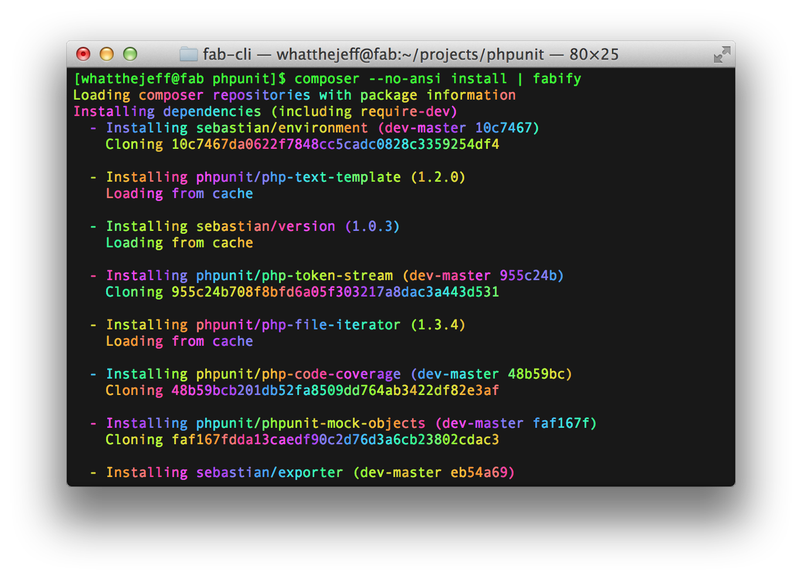
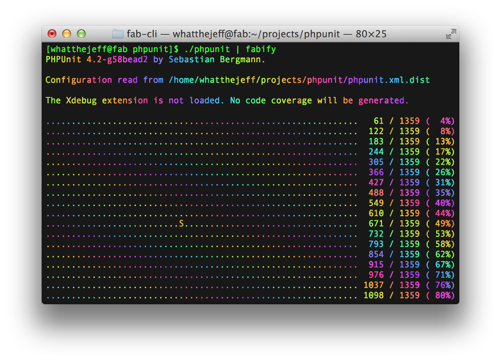

fab-cli
=======

Brighten up your shell!

## Commands

### fab

### fabify

## Requirements

fab-cli requires:

 * PHP 5.3.3 or later.
 * A terminal emulator with support for ANSI escape sequences.

## Installation

### Global

With cURL:

    $ sudo curl -Lo /usr/local/bin/fab https://github.com/whatthejeff/fab-cli/releases/download/v1.0.1/fab.phar
    $ sudo curl -Lo /usr/local/bin/fabify https://github.com/whatthejeff/fab-cli/releases/download/v1.0.1/fabify.phar
    $ sudo chmod a+x /usr/local/bin/fab /usr/local/bin/fabify

With Wget:

    $ sudo wget -O /usr/local/bin/fab https://github.com/whatthejeff/fab-cli/releases/download/v1.0.1/fab.phar
    $ sudo wget -O /usr/local/bin/fabify https://github.com/whatthejeff/fab-cli/releases/download/v1.0.1/fabify.phar
    $ sudo chmod a+x /usr/local/bin/fab /usr/local/bin/fabify

With composer:

    $ composer global require whatthejeff/fab-cli @stable
    $ export PATH="$PATH:$HOME/.composer/vendor/bin"

### Local

With cURL:

    $ curl -Lo fab https://github.com/whatthejeff/fab-cli/releases/download/v1.0.1/fab.phar
    $ curl -Lo fabify https://github.com/whatthejeff/fab-cli/releases/download/v1.0.1/fabify.phar
    $ chmod +x fab fabify
    $ export PATH="$PATH:$(pwd)"

With Wget:

    $ wget -O fab https://github.com/whatthejeff/fab-cli/releases/download/v1.0.1/fab.phar
    $ wget -O fabify https://github.com/whatthejeff/fab-cli/releases/download/v1.0.1/fabify.phar
    $ chmod +x fab fabify
    $ export PATH="$PATH:$(pwd)"

With composer:

    $ composer require whatthejeff/fab-cli @stable
    $ export PATH="$PATH:$(pwd)/vendor/bin"

## Usage

    $ fab command [args...]
    $ command [args...] | fabify

## Acknowledgements

fab-cli was inspired by:

 * [fabgit](https://github.com/erikaheidi/fabgit) by @erikaheidi
 * [Fab Symfony Console](https://github.com/igorw/fab-symfony-console) by @igorw

## License

fab-cli is licensed under the [MIT license](LICENSE).
